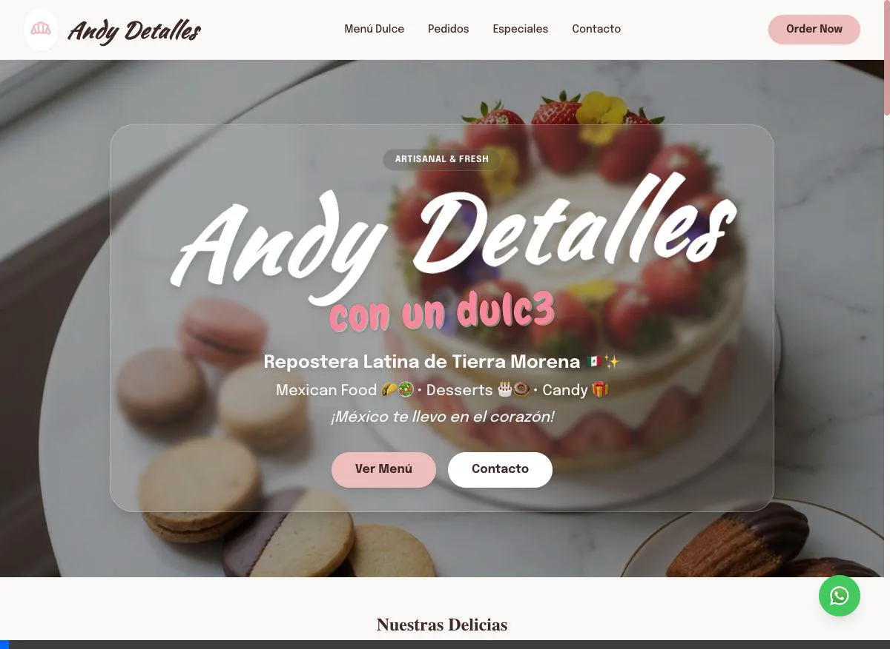

# Andy Detalles 🎂

Bienvenido al repositorio oficial de **Andy Detalles**. Este es un sitio web moderno y responsive diseñado para una tienda de repostería y regalos personalizados.

## Características Principales ✨

*   **Diseño Premium**: Interfaz limpia y elegante con animaciones suaves.
*   **Catálogo Interactivo**: Sección de productos destacados.
*   **Pedidos vía WhatsApp**: Formulario de cotización integrado que redirige automáticamente a WhatsApp con los detalles del pedido pre-llenados.
*   **Responsive**: Funciona perfectamente en móviles y escritorio.

## Demo de Integración WhatsApp 📱

Aquí puedes ver cómo funciona el sistema de pedidos automáticos:

## Tecnologías 🛠

*   HTML5
*   TailwindCSS (vía CDN)
*   JavaScript (Vanilla)
*   CSS3

## Instalación y Uso 🚀

1.  Clona el repositorio.
2.  Abre el archivo `index.html` en tu navegador.
3.  ¡Listo! No requiere instalación de dependencias `npm` para visualizarse (usa CDN).

---
Hecho con ❤️ para Andy Detalles.
